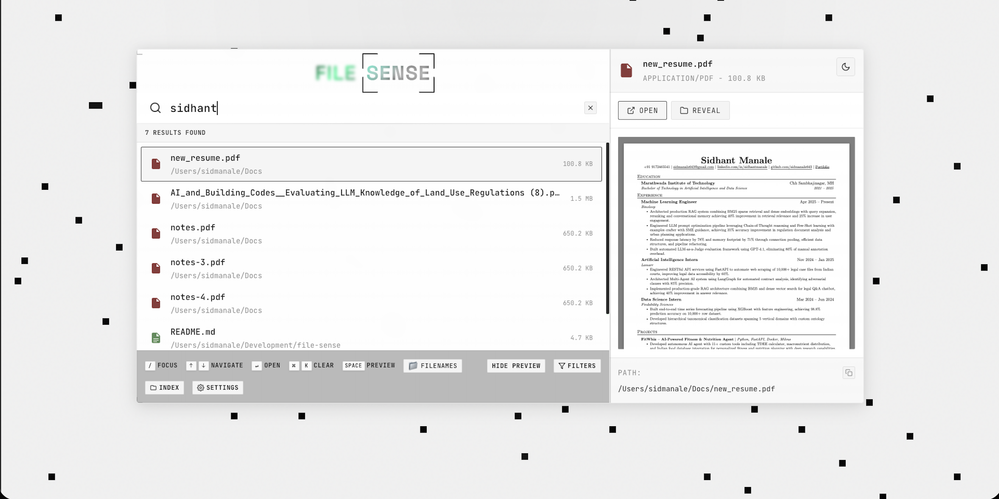

# FileSense

[](https://www.python.org/)
[](https://react.dev/)
[](LICENSE)
[](https://fastapi.tiangolo.com/)

A blazing-fast hybrid search engine combining BM25 and semantic search for local document retrieval. Search through PDFs, Word documents, and text files with intelligent ranking.



## Features

- **Hybrid Search**: Combines BM25 keyword matching with semantic/vector search for superior results
- **Multiple Document Formats**: PDF, DOCX, TXT, and more
- **Real-time Indexing**: Incremental updates as documents change
- **Hardware Adaptive**: Automatically adjusts to your system's capabilities (eco/balanced/performance modes)
- **Local-First**: All processing happens on your machine - no cloud required
- **Beautiful UI**: Modern React interface with smooth animations
- **Easy CLI**: One command to start everything

## Quick Start

### Prerequisites

- Python 3.12 or higher
- Node.js 18+ (for frontend development)
- [uv](https://github.com/astral-sh/uv) (Python package manager)

### Installation

**Option 1: Global Installation (Recommended)**
```bash
pip install -e .
```
This installs the `filesense` command globally, so you can use it from any directory.

**Option 2: Using uv (Development)**
```bash
uv sync
source .venv/bin/activate
filesense init
```

**Option 3: Without activating venv**
```bash
./.venv/bin/filesense init
```

### Running FileSense

After installation, simply run:
```bash
filesense init
```

This starts both services:
- **Backend**: http://localhost:8000 (FastAPI with auto-generated docs at `/docs`)
- **Frontend**: http://localhost:5173 (React + Vite)

### Custom Ports
```bash
filesense init --backend-port 8080 --frontend-port 3000
```

### Stopping
Press `Ctrl+C` to gracefully stop both servers.

## How It Works

FileSense uses a hybrid scoring approach:

1. **BM25 Retrieval**: Traditional keyword-based search for exact matches
2. **Semantic Search**: Dense vector embeddings capture meaning and context
3. **Smart Fusion**: Combines both scores using reciprocal rank fusion for optimal ranking

This means you get results that match your keywords AND understand the semantic meaning of your query.

## Project Structure

```
file-sense/
├── src/                    # Python backend
│   ├── main.py            # FastAPI application
│   ├── cli.py             # CLI entry point
│   └── services/          # Business logic
│       ├── hybrid_search.py
│       ├── bm25_ret.py
│       └── pipeline.py
├── frontend/              # React frontend
│   ├── src/
│   │   ├── components/
│   │   ├── hooks/
│   │   └── services/
│   └── package.json
├── docs/                  # Documentation
└── tests/                 # Test suite
```

## Development

### Backend Development
```bash
# Run backend only
uv run uvicorn src.main:app --reload

# Run specific service
uv run python src/services/hybrid_search.py
```

### Frontend Development
```bash
cd frontend
npm install
npm run dev
```

### Code Quality
```bash
# Python linting and formatting
ruff check src/
ruff format src/

# Frontend linting
cd frontend
npm run lint
```

## CLI Reference

```bash
filesense init              # Start both servers
filesense init --help       # See all options
```

## Hardware Modes

FileSense automatically detects your hardware and adjusts:

- **Eco Mode**: Low resource usage, suitable for laptops
- **Balanced**: Good performance with reasonable resource use
- **Performance**: Maximum speed on high-end machines

## API Documentation

Once running, visit http://localhost:8000/docs for interactive API documentation.

### Key Endpoints

- `POST /search` - Search indexed documents
- `POST /index` - Index a file or directory
- `GET /stats` - Get indexing statistics
- `DELETE /clear` - Clear all indexed data

## Supported Formats

- PDF (.pdf)
- Word Documents (.docx)
- Text Files (.txt)
- PowerPoint (.pptx) - via Docling
- Excel (.xlsx) - via Docling
- Code files (with syntax-aware chunking)

## Contributing

We welcome contributions! Please see [CONTRIBUTING.md](CONTRIBUTING.md) for guidelines.

1. Fork the repository
2. Create a feature branch (`git checkout -b feature/amazing-feature`)
3. Commit your changes (`git commit -m 'Add amazing feature'`)
4. Push to the branch (`git push origin feature/amazing-feature`)
5. Open a Pull Request

## Roadmap

- [ ] Cloud sync option
- [ ] Plugin system for custom document parsers
- [ ] Advanced query syntax (boolean operators, phrases)
- [ ] Export search results
- [ ] Mobile app

## Tech Stack

**Backend:**
- FastAPI + Uvicorn
- Sentence Transformers (embeddings)
- FAISS (vector search)
- Elasticsearch (BM25)
- Docling (document parsing)
- Chonkie (text chunking)

**Frontend:**
- React 19 + TypeScript 5.9
- Vite (build tool)
- Framer Motion (animations)
- Three.js (3D effects)

## License

This project is licensed under the MIT License - see the [LICENSE](LICENSE) file for details.

## Acknowledgments

- [Sentence Transformers](https://www.sbert.net/) for embedding models
- [Docling](https://github.com/DS4SD/docling) for document parsing
- [FastAPI](https://fastapi.tiangolo.com/) for the excellent web framework
- [uv](https://github.com/astral-sh/uv) for blazing-fast Python package management

## Support

If you encounter any issues or have questions:
- Open an [issue](https://github.com/sidmanale/file-sense/issues)
- Check the [documentation](docs/)

---

Made with ❤️ by [Sidhant Manale](https://github.com/sidmanale)
